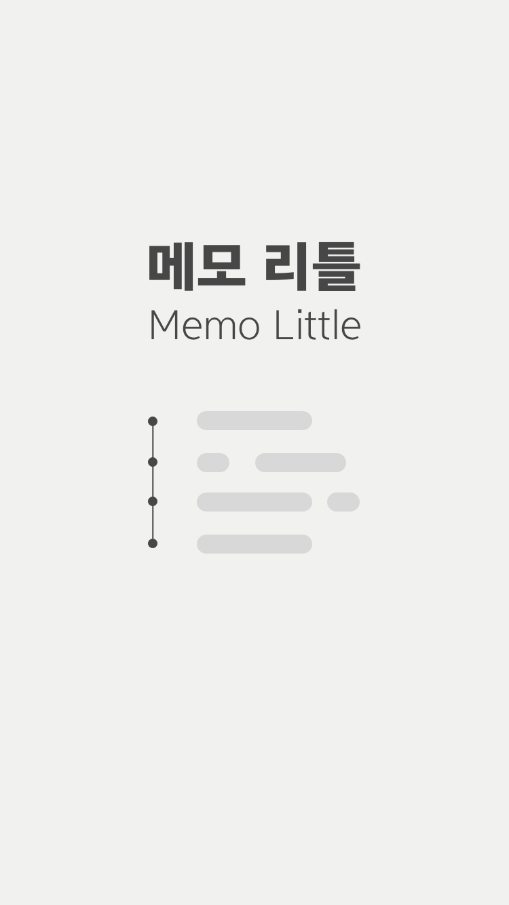
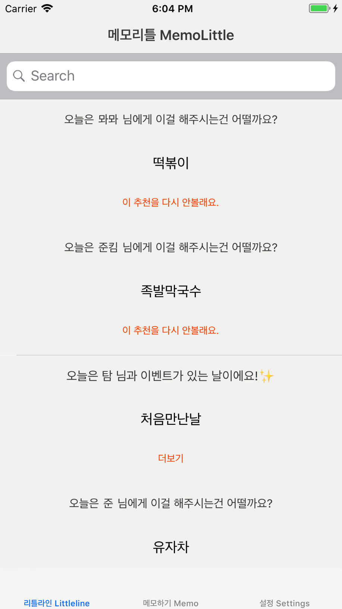
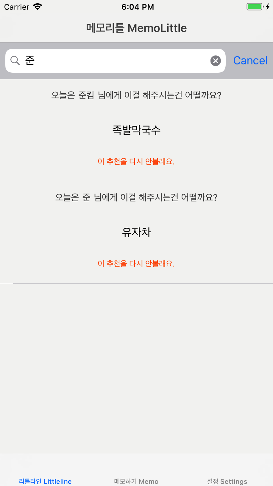

# 메모리틀 MEMOLITTLE

[프로젝트 제안서 링크](https://drive.google.com/open?id=0Bw5Hv-zbPEnYWEtYMjEyNHoyOEE)

```
사람에 대한 소소한 사실을 기록하는 메모 앱인데 이름은 메모리틀

엄마가 이 집 떡볶이를 좋아해 같은 건 나중에 찾아보기 어렵잖어

또 짝꿍이 녹차를 좋아하고 콜라는 잘 안먹는다는 것도

타임라인에는 매일매일 그런 소소한 사실들이 무직위로 뜨는 거지

'오늘은 뫄뫄님이 좋아하시는 이건 어떨까요?' 하고.

할 수 있을지는 모르겠지만 유니버설 디자인을 하고싶어.

시리에'메모리틀 이 사람한테 이렇게 적어줘' 라고 말하면 작동하는 기능을 넣어서

시력이 없는 사람이 앱을 말로 켜서 타임라인 읽어달라고하고 찾아달라고도 할수있는 그런 앱

비주얼 UI랑 speech recognition 두 방향에서 모든 기능 사용하는데 무리가 없도록

```


사람들에 대한 사소한 facts를 기록할 수 있는 앱

검색과 기록이 voice가 됐으면 좋겠음

메인 / 글쓰기 / 설정


# 메인
상단 검색 바 , 하단은 타임라인(혹은 사람별로 바꿀 수 있음)

무한 스크롤인데, 만약에 어떤 사람 - 날짜 연결되어 있으면 그 날짜 이벤트

아니면 어떤 사람은 뭘 좋아해요! 오늘은 이걸 해보는 게 어떨까요? 하고 띄움

타임라인에 띄울 사람 설정할 수 있음

‘타임라인 읽어줘’ 하면 읽을 수 있음


# 글쓰기
* 어떤 부분 복사 -> 공유해서 사람으로 할당 가능 (추가기능)

* 해시태그를 붙여서 좋아하는 거 입력할 수 있음

* 좋아하는거 / 싫어하는거 / 같이 있던 시간 / 기본정보

* 날짜 입력하면 생일 혹은 같이 있었던 시간 기록 가능

* 글 쓸 때 사람 선택 / 카테고리 선택 / 기록

* 좋아하는거나 싫어하는건 스페이스 기준으로 나뉘어서 등록되도록

* 혹은 진짜 그 blink처럼 기록되면 좋겠음

* 같이 있던 시간 : 날짜랑 내용만 기록하게 (사진은 나중에)

* 기본정보 : 이름 / 관계 / 나이 / 추가 메모


# 설정
글자 크기 선택

비밀번호 (추가기능)

정보

# 스크린 샷








